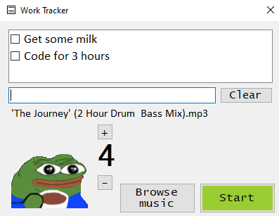

# Minimal Todo List
Intentionally only has support for 3 todo items and no audio controls. The intention is to allow a focus on three essential tasks and no tinkering with the background audio.

* Display any image or gif below 112x112 pixels
* Choose any media to trigger once your work session starts. Audio loops if the audio runs out before timer does.
	* Support for the following formats: **.mp3**, **.wav**, **.m4a**, **.flac**, **.m3u** 
* Locking the window in any corner of the monitor (the monitor containing most of the applications window).
* Support for keep on top of other windows
## Usage
Click on AppTimer.exe in the root folder.
### Prerequisite
* Windows Media Player
* .NET 4.5+
* Interop.WMPLib.dll, LiteDB.dll, MyData.db are all in the same folder as Apptimer.exe

